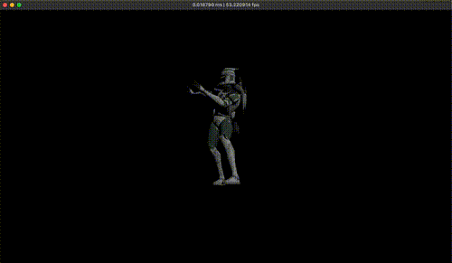

# Skeletal Animation with Vulkan

[](./docs/video/screen_recording.mov)

*Video quality is poor after conversion, original at `/docs/video/screen_recording.mov`*

A real-time 3D animation renderer written in C++ using the Vulkan graphics API. Loads glTF models with skeletal animation and renders them with a physically-based shading model. Implemented from scratch without a graphics engine or high-level framework.

## Requirements

- CMake 3.15+
- Ninja
- Vulkan SDK (with `glslc` on your PATH)
- Clang or GCC with C++20 support

## Building
```sh
git clone https://github.com/skrpov/vulkan-animation --recursive
cd vulkan-animation
cmake -S . -B build -G Ninja
cmake --build build
./build/app
```
